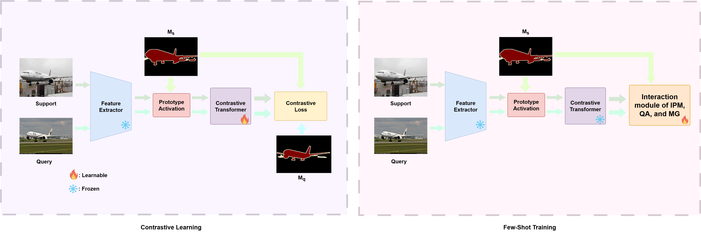
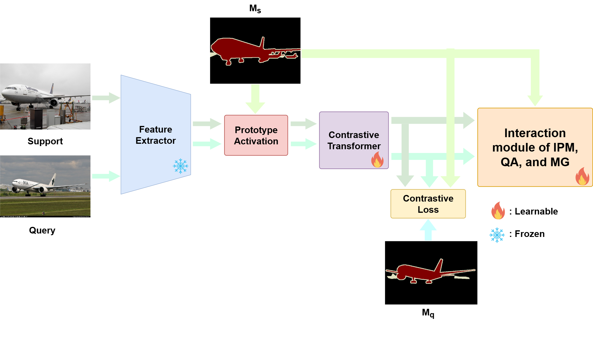

# Intermediate Prototype Mining Transformer for Few-Shot Semantic Segmentation
This repo contains the code for our "*IPMT++: Improving Few-shot Semantic Segmentation with Contrastive Learning*" by Ching Chen, Hsin Lung Wu.

<p align="middle">
  
</p>
<p align="middle">
  
</p>


## Dependencies

- Python 3.8
- PyTorch 1.7.0
- cuda 11.0
- torchvision 0.8.1
- tensorboardX 2.14

## Datasets

- PASCAL-5<sup>i</sup>:  [VOC2012](http://host.robots.ox.ac.uk/pascal/VOC/voc2012/) + [SBD](http://home.bharathh.info/pubs/codes/SBD/download.html)

- COCO-20<sup>i</sup>:  [COCO2014](https://cocodataset.org/#download)

### Models

- We provide all trained TPMT [models](https://drive.google.com/drive/folders/1qgxKQSQvGOqLqAdzGmnyHuaBUxpesJNE?usp=sharing) for performance evaluation.

### Scripts

- **Step1** *choose training methods*

  We use git branch to change the training method scripts. We have *two-stage* and *single-stage*.
  ```
  git checkout training_method
  ```

- **Step1** *setting the config*

  Change configuration via the `.yaml` files in `config`.
  
- **Step2** *Training*

  Run for contrastive learning.
  ```
  python train_contrastive.py --config /path/to/config_file
  ```

  Run for few-shot training.
  ```
  python train.py --config /path/to/config_file
  ```

- **Step3** *Testing*

  Run for testing.
  ```
  python test.py --config /path/to/config_file
  ```

### Visualization

<p align="middle">
    
</p>

## References

This repo is mainly built based on [IPMT](https://github.com/LIUYUANWEI98/IPMT). Thanks for their great work!
